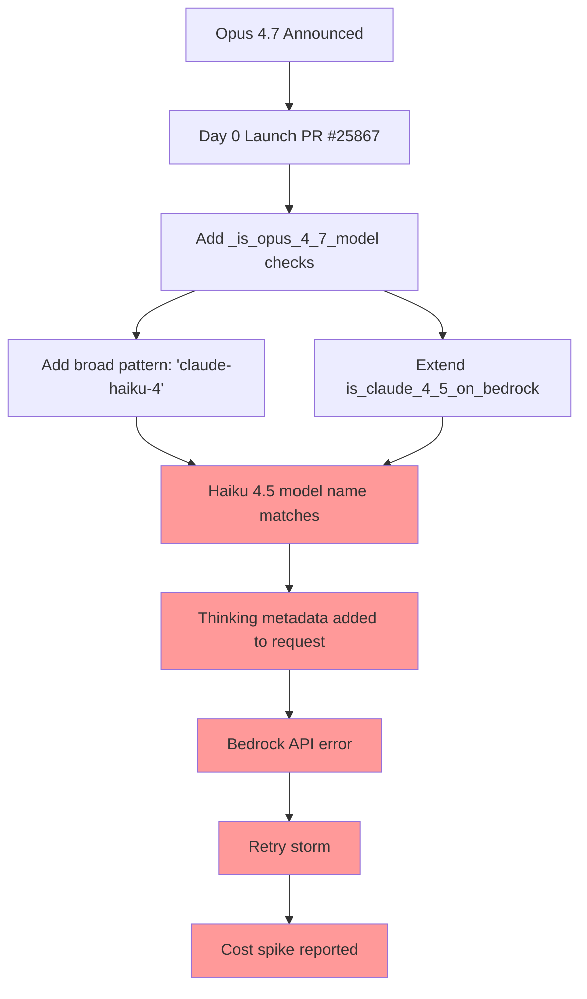

# Code Pattern Analysis: Opus 4.7 Breaking Haiku 4.5

This document shows the specific code patterns from the Opus 4.7 PRs that likely caused the Haiku 4.5 regression.

---

## Pattern 1: Broad Substring Matching

### Problem Code (likely in PR #25867/#25876)

```python
# File: litellm/llms/bedrock/messages/invoke_transformations/anthropic_claude3_transformation.py

def _supports_extended_thinking_on_bedrock(model: str) -> bool:
    """Check if model supports extended thinking on Bedrock"""
    
    # ❌ PROBLEM: This catches BOTH Haiku 4.5 AND Haiku 4.7+
    if "claude-haiku-4" in model:
        return True
    
    if "claude-opus-4" in model:
        return True
        
    if "claude-sonnet-4" in model:
        return True
    
    return False
```

### Why This Breaks

```python
# These all match the pattern "claude-haiku-4":
"anthropic.claude-haiku-4-5-20251001-v1:0"  # ❌ Haiku 4.5 - doesn't support extended thinking!
"anthropic.claude-haiku-4-7-20260416-v1:0"  # ✅ Haiku 4.7 - supports it

# Result: Both get extended thinking metadata → Haiku 4.5 requests fail
```

### What Should Happen

```python
def _supports_extended_thinking_on_bedrock(model: str) -> bool:
    """Check if model supports extended thinking on Bedrock"""
    
    # ✅ CORRECT: Explicit version checks
    haiku_patterns = ["haiku-4-6", "haiku_4_6", "haiku-4.6",
                      "haiku-4-7", "haiku_4_7", "haiku-4.7"]
    
    # Explicitly exclude 4.5
    if any(p in model.lower() for p in ["haiku-4-5", "haiku_4_5", "haiku-4.5"]):
        return False
    
    # Only match 4.6+
    if any(p in model.lower() for p in haiku_patterns):
        return True
    
    # Similar for Opus and Sonnet...
    return False
```

---

## Pattern 2: Misleading Function Scope

### Problem Code (from PR #25876)

```python
# File: litellm/llms/bedrock/common_utils.py
# Lines 565-597

def is_claude_4_5_on_bedrock(model: str) -> bool:
    """
    Claude 4.5 models support prompt caching with '5m' and '1h' TTL
    
    Returns:
        bool: True if model is Claude 4.5 on Bedrock
    """
    model_lower = model.lower()
    
    claude_4_5_patterns = [
        # Original 4.5 patterns
        "sonnet-4.5", "sonnet_4.5", "sonnet-4-5", "sonnet_4_5",
        "haiku-4.5",  "haiku_4.5",  "haiku-4-5",  "haiku_4_5",
        "opus-4.5",   "opus_4.5",   "opus-4-5",   "opus_4_5",
        
        # 4.6 patterns added later
        "sonnet-4.6", "sonnet_4.6", "sonnet-4-6", "sonnet_4_6",
        "opus-4.6",   "opus_4.6",   "opus-4-6",   "opus_4_6",
        
        # 🚨 NEW in Opus 4.7 PR: Now includes 4.7!
        "opus-4.7",   "opus_4.7",   "opus-4-7",   "opus_4_7",
    ]
    
    return any(pattern in model_lower for pattern in claude_4_5_patterns)
```

### Why This Breaks

**Before Opus 4.7 PR:**
```python
is_claude_4_5_on_bedrock("anthropic.claude-haiku-4-5-...")  # True
is_claude_4_5_on_bedrock("anthropic.claude-opus-4-6-...")   # True
is_claude_4_5_on_bedrock("anthropic.claude-opus-4-7-...")   # False
```

**After Opus 4.7 PR:**
```python
is_claude_4_5_on_bedrock("anthropic.claude-haiku-4-5-...")  # True
is_claude_4_5_on_bedrock("anthropic.claude-opus-4-6-...")   # True
is_claude_4_5_on_bedrock("anthropic.claude-opus-4-7-...")   # ✅ True (NEW!)
```

**Impact on Callsites:**

If any code does this:
```python
if is_claude_4_5_on_bedrock(model):
    # Apply 4.5-specific logic
    enable_prompt_caching()
    set_thinking_mode("adaptive")  # ← This might have been 4.5-specific!
```

Now Opus 4.7 triggers that code path too! If that path includes logic that only works for 4.5/4.6, it might accidentally affect other models.

### What Should Happen

```python
# Option A: Rename function to reflect actual scope
def is_modern_claude_on_bedrock(model: str) -> bool:
    """
    Claude 4.5+ models support advanced features like prompt caching
    
    Returns:
        bool: True if model is Claude 4.5, 4.6, or 4.7 on Bedrock
    """
    # Clear that it covers multiple versions
    pass

# Option B: Use semantic version checks
def supports_prompt_caching_on_bedrock(model: str) -> bool:
    """Check if model supports prompt caching via JSON lookup"""
    return get_model_capability(model, "supports_prompt_caching")
```

---

## Pattern 3: Duplicate/Redundant Checks

### Problem Code (from Greptile review of PR #25876)

```python
# File: litellm/llms/anthropic/chat/transformation.py
# Lines 237-248

def get_supported_openai_params(model: str, custom_llm_provider: str):
    supported_params = ["temperature", "top_p", "max_tokens"]
    
    # ❌ REDUNDANT: Check added for 4.7
    if _is_claude_4_7_model(model):
        supported_params.extend(["thinking", "reasoning_effort"])
    # ✅ This already covers 4.7 because the JSON has supports_reasoning: true!
    elif supports_reasoning(model, custom_llm_provider):
        supported_params.extend(["thinking", "reasoning_effort"])
    
    return supported_params
```

### Why This Matters

From Greptile review:
> "`claude-opus-4-7` has `supports_reasoning: true` in `model_prices_and_context_window.json`, so the `or supports_reasoning(...)` branch already covers it. The explicit `_is_claude_4_7_model` guard is dead code under any recognised 4.7 model name."

**The deeper problem:** If the explicit check runs FIRST, it shortcuts the `supports_reasoning()` call. This means:
1. The JSON-based system is bypassed
2. Any bugs in `supports_reasoning()` are hidden
3. Future model additions can't use the JSON system because the hardcoded checks shadow it

---

## Pattern 4: The Root Cause - Provider Name Mismatch

### The Real Bug (from PR #24053 analysis)

```python
# File: litellm/utils.py (simplified)

def supports_reasoning(model: str, custom_llm_provider: str) -> bool:
    """Check if model supports reasoning from JSON"""
    model_info = _get_model_info_helper(
        model=model,
        custom_llm_provider=custom_llm_provider  # ← "bedrock"
    )
    return model_info.get("supports_reasoning", False)

def _get_model_info_helper(model: str, custom_llm_provider: str):
    """Look up model in cost map"""
    # Looks for entry with matching litellm_provider
    
    # Problem: JSON has litellm_provider: "bedrock_converse"
    # But we're searching with custom_llm_provider: "bedrock"
    # 
    # Mismatch! Returns None → supports_reasoning = False
    pass
```

### Model Entry in JSON

```json
{
  "anthropic.claude-haiku-4-5-20251001-v1:0": {
    "max_tokens": 64000,
    "max_input_tokens": 200000,
    "input_cost_per_token": 0.0000004,
    "output_cost_per_token": 0.000002,
    "litellm_provider": "bedrock_converse",  // ← Note: "bedrock_converse"
    "mode": "chat",
    "supports_vision": true,
    "supports_reasoning": false  // ← Haiku 4.5 doesn't support reasoning!
  },
  "anthropic.claude-opus-4-7-...": {
    "litellm_provider": "bedrock_converse",
    "supports_reasoning": true,  // ← Opus 4.7 DOES support reasoning
    "supports_xhigh_reasoning_effort": true
  }
}
```

### Why Hardcoded Checks Were Added

Because `supports_reasoning()` doesn't work for Bedrock (returns `False` even when JSON says `True`), developers added hardcoded checks as workarounds:

```python
# Workaround pattern seen throughout codebase:
if _is_claude_4_6_model(model) or _is_claude_4_7_model(model):
    # Hardcoded: We know these support reasoning
    add_reasoning_params()
elif supports_reasoning(model, provider):
    # This branch never executes for Bedrock! ❌
    add_reasoning_params()
```

**The cascade effect:**
1. `supports_reasoning()` is broken for Bedrock
2. Developers add hardcoded checks as workarounds
3. Hardcoded checks use broad patterns (`"claude-haiku-4"`)
4. Broad patterns catch unintended models (Haiku 4.5)
5. Wrong behavior applied to wrong models
6. Production regression

---

## How This Affected Haiku 4.5

### Request Flow (Before Opus 4.7)

```
User request → Haiku 4.5 on Bedrock
    ↓
Check: is_claude_4_5_on_bedrock() → True (4.5 pattern matches)
    ↓
Check: _supports_extended_thinking_on_bedrock() → False (no "haiku-4" check)
    ↓
Request sent WITHOUT thinking metadata
    ↓
✅ Bedrock accepts request → Normal cost
```

### Request Flow (After Opus 4.7)

```
User request → Haiku 4.5 on Bedrock
    ↓
Check: is_claude_4_5_on_bedrock() → True (4.5 pattern matches)
    ↓
Check: _supports_extended_thinking_on_bedrock() → True ❌ (NEW "haiku-4" check matches!)
    ↓
Request sent WITH thinking metadata ❌
    ↓
❌ Bedrock rejects: "unsupported thinking metadata"
    ↓
LiteLLM retries (3x default?) ❌
    ↓
💰💰💰 3x normal cost!
```

---

## The Complete Picture



---

## Fix Strategy

### 1. Immediate Hotfix

```python
# File: litellm/llms/bedrock/messages/invoke_transformations/anthropic_claude3_transformation.py

def _supports_extended_thinking_on_bedrock(model: str) -> bool:
    """Check if model supports extended thinking on Bedrock"""
    model_lower = model.lower()
    
    # ✅ EXPLICIT EXCLUSION: Haiku 4.5 does NOT support extended thinking
    haiku_45_patterns = ["haiku-4-5", "haiku_4_5", "haiku-4.5", "haiku_4.5"]
    if any(p in model_lower for p in haiku_45_patterns):
        return False
    
    # Now safe to check broader patterns for 4.6+
    if "claude-haiku-4" in model_lower:  # Catches 4.6, 4.7, etc.
        return True
    
    if "claude-opus-4" in model_lower:
        return True
        
    if "claude-sonnet-4" in model_lower:
        return True
    
    return False
```

### 2. Architectural Fix

```python
# Fix the provider name mismatch in _get_model_info_helper

def _get_model_info_helper(model: str, custom_llm_provider: str):
    """Look up model in cost map with provider normalization"""
    
    # ✅ NORMALIZE Bedrock provider names
    if custom_llm_provider in ["bedrock", "bedrock_converse"]:
        # Try both variants
        info = _lookup(model, "bedrock_converse")
        if not info:
            info = _lookup(model, "bedrock")
        return info
    
    return _lookup(model, custom_llm_provider)

# Then REMOVE all hardcoded model checks and use:
if supports_reasoning(model, provider):
    add_reasoning_params()
```

---

## Lessons Learned

1. **Broad substring matching is dangerous**
   - `"claude-haiku-4"` matches 4.0, 4.5, 4.6, 4.7, 4.99...
   - Use explicit version checks or semantic versioning

2. **Function names must match scope**
   - `is_claude_4_5_on_bedrock()` covering 4.5/4.6/4.7 is misleading
   - Rename or refactor when scope expands

3. **Hardcoded checks hide architectural bugs**
   - `supports_reasoning()` being broken led to workarounds
   - Workarounds created new bugs (this regression)
   - Fix root cause instead of adding workarounds

4. **CI/CD is critical**
   - Opus 4.7 skipped full CI/CD
   - Integration tests would have caught Haiku 4.5 regression

5. **JSON-based configuration only works if it actually works**
   - LiteLLM has great design: model capabilities in JSON
   - But implementation is broken for Bedrock provider
   - Document says "just add JSON entry" but reality requires code changes
